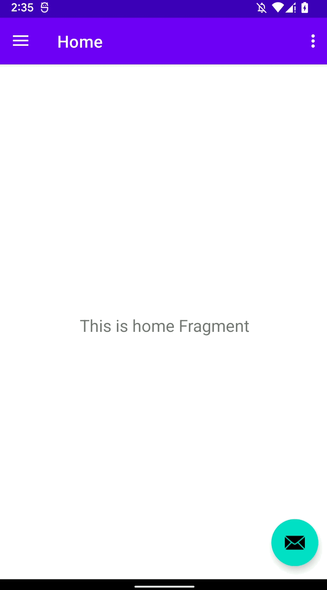

# Практикум по NavigationDrawer

Для навигации в сложном приложении может потребоваться NavigationDrawer.

- сделайте фон логотипа прозрачным
- адаптируйте градиент в `side_nav_bar.xml` к цвету логотипа
- создайте новый фрагмент "о приложении" и добавьте его в меню NavigationDrawer

При создании приложения выберите активность с NavigationDrawer или используйте [заготовку приложения](https://github.com/ipetrushin/NavigationDrawerDemo)

[Логотип ИГУ отдельным файлом](https://github.com/ipetrushin/NavigationDrawerDemo/blob/master/app/src/main/res/drawable/isulogo.png)

## Демонстрация работы

|  |
| ----------------------- |

